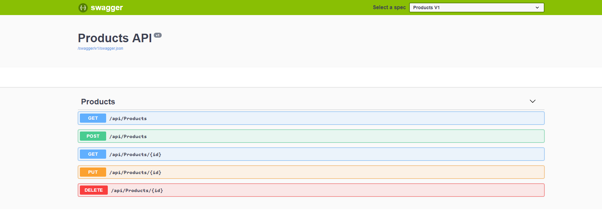
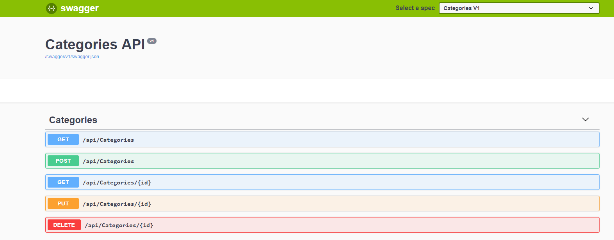
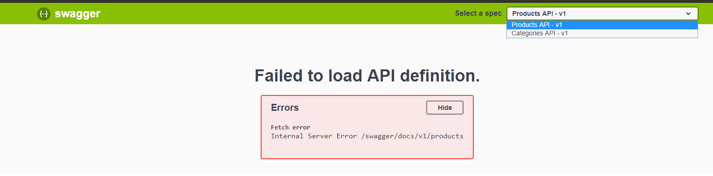

# Introduction
ASP.NET Core 2.2 Microservices Basic Tutorial (API GATEWAY + Simple Microservice + Swagger)

In this tutorial i will show you how to create your first microservice like application, in which we will use an API gateway, 2 microservices that handles the CRUD of products and categories.

We will not talk about the microservices communication because its another subject that needs a special tutorial.

# Requirements
+ .NET Core 2.2
+ Visual Studio or Visual Studio Code (In this tutorial i will use Visual Studio Code because it is easily accessible by everyone)

# Creating the microservices
Lets start by making the microservices

## The products microservice
We will start by creating the project

```shell
mkdir products 
cd products
dotnet new webapi
```

Go to the file ``Controllers\ValuesController.cs`` rename it to ``ProductsController`` and changes it like this
```csharp
using System;
using System.Collections.Generic;
using System.Linq;
using System.Threading.Tasks;
using Microsoft.AspNetCore.Mvc;

namespace products.Controllers
{
    [Route("api/[controller]")]
    [ApiController]
    public class ProductsController : ControllerBase
    {
        static List<string> products_data = new List<string>();
        // GET api/products
        [HttpGet]
        public ActionResult<IEnumerable<string>> Get()
        {
            return products_data;
        }

        // GET api/products/5
        [HttpGet("{id}")]
        public ActionResult<string> Get(int id)
        {
            return products_data[id];
        }

        // POST api/products
        [HttpPost]
        public void Post([FromBody] string value)
        {
            products_data.Add(value);
        }

        // PUT api/products/5
        [HttpPut("{id}")]
        public void Put(int id, [FromBody] string value)
        {      
             products_data.RemoveAt(id);
             products_data.Insert(id, value);
        }

        // DELETE api/products/5
        [HttpDelete("{id}")]
        public void Delete(int id)
        {
            products_data.RemoveAt(id);
        }
    }
}

```

After testing with the ``dotnet run`` command we will notice that our application will be running under ports 5000 for http and 5001 for https.

## The categories microservice
We shall start by going back to the root project folder then we will create another project

```shell
mkdir categories 
cd categories
dotnet new webapi
```

Go to the file ``Controllers\ValuesController.cs`` rename it to ``CategoriesController`` and changes it like this
```csharp
using System;
using System.Collections.Generic;
using System.Linq;
using System.Threading.Tasks;
using Microsoft.AspNetCore.Mvc;

namespace categories.Controllers
{
    [Route("api/[controller]")]
    [ApiController]
    public class CategoriesController : ControllerBase
    {
        static List<string> categories_data = new List<string>();
        // GET api/categories
        [HttpGet]
        public ActionResult<IEnumerable<string>> Get()
        {
            return categories_data;
        }

        // GET api/categories/5
        [HttpGet("{id}")]
        public ActionResult<string> Get(int id)
        {
            return categories_data[id];
        }

        // POST api/categories
        [HttpPost]
        public void Post([FromBody] string value)
        {
            categories_data.Add(value);
        }

        // PUT api/categories/5
        [HttpPut("{id}")]
        public void Put(int id, [FromBody] string value)
        {       
             categories_data.RemoveAt(id);
             categories_data.Insert(id, value);
      

        }

        // DELETE api/categories/5
        [HttpDelete("{id}")]
        public void Delete(int id)
        {
            categories_data.RemoveAt(id);
        }
    }
}

```

After testing with the ``dotnet run`` command we will notice that our application will be running under ports 5000 for http and 5001 for https.

# Adding swagger support
For both porjects we will add the Swagger support, in this section i am going to do this step for one project then i will replicate it in the other one.

I selected the products project

## Adding swagger support for products microservice
Go to ``products/products.csproj`` and edit its code

We will add the swagger package reference
```xml
    <PackageReference Include="Swashbuckle.AspNetCore" Version="4.0.1" />
```
under

```xml
 <ItemGroup>
    <PackageReference Include="Microsoft.AspNetCore.App" />
```
then we will execute ``dotnet restore``

the final csproj file will look like this
```xml
<Project Sdk="Microsoft.NET.Sdk.Web">
  <PropertyGroup>
    <TargetFramework>netcoreapp2.2</TargetFramework>
    <AspNetCoreHostingModel>InProcess</AspNetCoreHostingModel>
  </PropertyGroup>
  <ItemGroup>
    <PackageReference Include="Microsoft.AspNetCore.App" />
    <PackageReference Include="Swashbuckle.AspNetCore" Version="4.0.1" />
    <PackageReference Include="Microsoft.AspNetCore.Razor.Design" Version="2.2.0" PrivateAssets="All" />
  </ItemGroup>
</Project>

```

We edit the ``Startup.cs`` file, by changing the ``ConfigureServices`` and ``Configure`` methods.

+ We will disable the https redirection
+ We will use the default developer exception page
+ We will add swagger middleware
```csharp
        // This method gets called by the runtime. Use this method to add services to the container.
        public void ConfigureServices(IServiceCollection services)
        {
            services.AddMvc().SetCompatibilityVersion(CompatibilityVersion.Version_2_2);
            // Swagger
            services.AddSwaggerGen(c =>
            {
                c.SwaggerDoc("v1", new Info { Title = "Products API", Version = "v1" });
            });
        }

        // This method gets called by the runtime. Use this method to configure the HTTP request pipeline.
        public void Configure(IApplicationBuilder app, IHostingEnvironment env)
        {
            app.UseDeveloperExceptionPage();
            app.UseMvc();
            // Swagger
            app.UseSwagger();
            app.UseSwaggerUI(c =>
            {
                c.SwaggerEndpoint("/swagger/v1/swagger.json", "Products V1");
            });
        }
```

and we will add a using reference

```csharp
using Swashbuckle.AspNetCore.Swagger;
```

We will finish by editing ``Program.cs`` to enable kestrel and specify the listen url.
In order to do that we shall replace the ``CreateWebHostBuilder`` method by this
```csharp
      public static IWebHostBuilder CreateWebHostBuilder(string[] args) =>
            WebHost.CreateDefaultBuilder(args)
                .UseKestrel()
                .UseUrls("http://0.0.0.0:5000")
                .UseStartup<Startup>();
```

### Testing swagger support
Openning ``http://localhost:5000/swagger/index.html`` after a ``dotnet run`` will give the results below

**Products**



**Categories**



# Creating the api gateway
We will start by creating the project

```shell
mkdir gateway 
cd gateway
dotnet new webapi
```

we shall remove the folder ``Controllers`

We will add a package called ``Ocelot``

We will run 
```shell
dotnet add package Ocelot
dotnet add package MMLib.SwaggerForOcelot
```

## Configuring the gateway
For more information go to https://ocelot.readthedocs.io/en/latest/features/configuration.html

We will start by creating a json file called ``ocelot.json``

knowing that we will be deploying the application to a kubernetes cluster under a namespace called ``devops-workshop`` the result dns names for services will be:

+ products.devops-workshop.svc.cluster.local for the products service
+ categories.devops-workshop.svc.cluster.local for the categories service
+ gateway.devops-workshop.svc.cluster.local for the gateway service


the content of ``ocelot.json`` will be
```json
{
    "ReRoutes": [
        {
            "DownstreamPathTemplate": "/api/categories/{everything}",
            "DownstreamScheme": "http",
            "DownstreamHostAndPorts": [
                    {
                        "Host": "categories.devops-workshop.svc.cluster.local",
                        "Port": 5000
                    }
                ],
            "UpstreamPathTemplate": "/categories/{everything}",
            "SwaggerKey": "categories"
        },
        {
            "DownstreamPathTemplate": "/api/products/{everything}",
            "DownstreamScheme": "http",
            "DownstreamHostAndPorts": [
                    {
                        "Host": "products.devops-workshop.svc.cluster.local",
                        "Port": 5000
                    }
                ],
            "UpstreamPathTemplate": "/products/{everything}",
            "SwaggerKey": "products"
        }
    ],
    "SwaggerEndPoints": [
        {
        "Key": "products",
        "Config": [
                {
                "Name": "Products API",
                "Version": "v1",
                "Url": "http://products.devops-workshop.svc.cluster.local:5000/swagger/v1/swagger.json"
                }
            ]
        },
        {
        "Key": "categories",
        "Config": [
                {
                "Name": "Categories API",
                "Version": "v1",
                "Url": "http://categories.devops-workshop.svc.cluster.local:5000/swagger/v1/swagger.json"
                }
            ]
        }
    ],
    "GlobalConfiguration": {

    }
}
```
Then we change the ``Program.cs`` file
```csharp
using System;
using System.Collections.Generic;
using System.IO;
using System.Linq;
using System.Threading.Tasks;
using Microsoft.AspNetCore;
using Microsoft.AspNetCore.Hosting;
using Microsoft.Extensions.Configuration;
using Microsoft.Extensions.Logging;

namespace gateway
{
    public class Program
    {
        public static void Main(string[] args)
        {
            CreateWebHostBuilder(args).Build().Run();
        }

        public static IWebHostBuilder CreateWebHostBuilder(string[] args) =>
            WebHost.CreateDefaultBuilder(args)
                .ConfigureAppConfiguration((hostingContext, config) =>
                {
                    config
                        .SetBasePath(hostingContext.HostingEnvironment.ContentRootPath)
                        .AddJsonFile("appsettings.json", true, true)
                        .AddJsonFile($"appsettings.{hostingContext.HostingEnvironment.EnvironmentName}.json", true, true)
                        .AddJsonFile("ocelot.json")
                        .AddEnvironmentVariables();
                })
                .UseKestrel()
                .UseUrls("http://0.0.0.0:5000")
                .UseStartup<Startup>();
    }
}
```

We open the ``Startup.cs``
```csharp
using System;
using System.Collections.Generic;
using System.Linq;
using System.Threading.Tasks;
using Microsoft.AspNetCore.Builder;
using Microsoft.AspNetCore.Hosting;
using Microsoft.AspNetCore.HttpsPolicy;
using Microsoft.AspNetCore.Mvc;
using Microsoft.Extensions.Configuration;
using Microsoft.Extensions.DependencyInjection;
using Microsoft.Extensions.Logging;
using Microsoft.Extensions.Options;
using MMLib.SwaggerForOcelot.Configuration;
using Ocelot.Configuration;
using Ocelot.DependencyInjection;
using Ocelot.Middleware;

namespace gateway
{
    public class Startup
    {
        public Startup(IConfiguration configuration)
        {
            Configuration = configuration;
        }

        public IConfiguration Configuration { get; }

        // This method gets called by the runtime. Use this method to add services to the container.
        public void ConfigureServices(IServiceCollection services)
        {
            services.AddMvc().SetCompatibilityVersion(CompatibilityVersion.Version_2_2);
            services.AddOcelot();
            services.AddSwaggerForOcelot(Configuration);
        }

        // This method gets called by the runtime. Use this method to configure the HTTP request pipeline.
        public void Configure(IApplicationBuilder app, IHostingEnvironment env)
        {
            app.UseDeveloperExceptionPage();
            app.UseMvc();
            app.UseSwaggerForOcelotUI(Configuration,  opt => { opt.EndPointBasePath = "/swagger/docs"; }).UseOcelot().Wait(); 
        }
    }
}

```

### Testing api gateway
Openning ``http://localhost:5000/swagger/index.html`` after a ``dotnet run`` will give the results below



# Dockerizing the application
## Creating docker files
for each project create a Dockerfile the base file content will include (in this case we have the products docker file, just replace **products** by **categories** or **gateway**)
```Dockerfile
FROM microsoft/dotnet:2.2-aspnetcore-runtime-stretch-slim AS base
WORKDIR /app
EXPOSE 80
EXPOSE 443

FROM microsoft/dotnet:2.2-sdk-stretch AS build
WORKDIR /src
COPY ["gateway/gateway.csproj", "gateway/"]
RUN dotnet restore "gateway/gateway.csproj"
COPY . .
WORKDIR "/src/gateway"
RUN dotnet build "gateway.csproj" -c Release -o /app

FROM build AS publish
RUN dotnet publish "gateway.csproj" -c Release -o /app

FROM base AS final
WORKDIR /app
COPY --from=publish /app .
ENTRYPOINT ["dotnet", "gateway.dll"]
```

## Building images
Run the docker build command for each project

The command below builds a docker image of the **gateway** project.
```shell
docker build -t "devops-workshop/gateway" -f "Dockerfile" --label "com.microsoft.created-by=visual-studio" ".."
```


The command below builds a docker image of the **products** project.
```shell
docker build -t "devops-workshop/products" -f "Dockerfile" --label "com.microsoft.created-by=visual-studio" ".."
```


The command below builds a docker image of the **categories** project.
```shell
docker build -t "devops-workshop/categories" -f "Dockerfile" --label "com.microsoft.created-by=visual-studio" ".."
```
## Using Azure DevOps
Go to https://azure.microsoft.com/en-us/services/devops/
Create an azure devops organisation, then create a project


# Creating YAML Files for kubernetes
